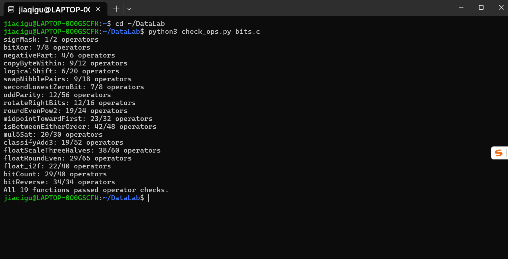
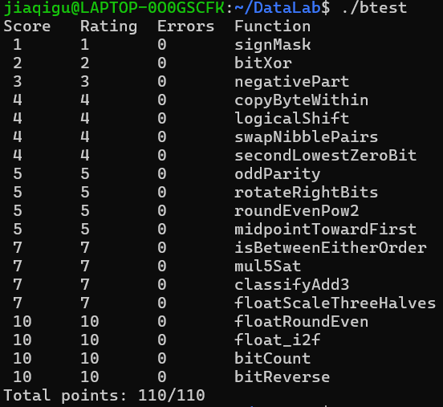

# Lab1 DataLab 实验报告

> 姓名：顾嘉琦　　学号：25303060042

## 1. 实验概述

本实验在只允许 `! ~ & ^ | + << >>` 等少量运算符（部分题目限制更严）、禁用控制语句与常量大于 255 的约束下，完成 19 个整数 / 浮点位级编程谜题，练习补码、掩码、移位、溢出与 IEEE 754 舍入。

- 测试环境：x86-64 Linux（WSL Ubuntu），编译参数 `-O -Wall -fwrapv`（与 GitHub Actions 自动评分一致）。
- 最终结果：`./check_ops.py bits.c` 19 题全部通过；`./btest` 得到 **Total points: 110/110**。

## 2. 测试截图

### 规则检查 `./check_ops.py bits.c`

### 正确性测试 `./btest`

## 3. 各函数实现思路

### P1 signMask（1/2 ops）

`1 << 31` 把 1 移到符号位，直接得到 `0x80000000`。

### P2 bitXor（7/8 ops）

异或的定义是"两个位不同"，即"至少一个为 1"且"不都为 1"：

- `~(~x & ~y)`：至少一个 1（不是都为 0）
- `~(x & y)`：不都为 1

两者按位与即为异或。

### P3 negativePart（4/6 ops）

`x >> 31` 算术右移得到全 1（x 为负）或全 0（x 非负）的掩码；`~x + 1` 是 `-x`；两者按位与即可在非负时清零。`INT_MIN` 时 `-x` 回绕仍是 `INT_MIN`，与参考行为一致。

### P4 copyByteWithin（9/12 ops）

`(x >> (src << 3)) & 0xff` 取出第 src 字节（算术右移带入的符号位被掩掉），构造 `s = dst << 3` 的掩码 `0xff << s`，把 x 的目标字节清空后放入 `b << s`。

### P5 logicalShift（6/20 ops）

先做算术右移，再用掩码清除高 n 位符号污染：`~(((1 << 31) >> n) << 1)` 在 n=0 时恰为全 1，n=31 时为 `0x00000001`，无需特判。

### P6 swapNibblePairs（9/18 ops）

掩码 `0x0f0f0f0f` 由 `0x0f` 两次翻倍（`|` + `<< 8`、`|` + `<< 16`）生成；低半字节左移 4 位与高半字节右移 4 位后拼回。

### P7 secondLowestZeroBit（7/8 ops）

`y = ~x` 后 0 位变 1 位。`z = y & (y + ~0)`（即 `y & (y-1)`）抹掉最低的 1；`z & (~z + 1)` 取剩余部分的最低位 1，即原来第二个最低 0 位。不足两个 0 位时 z 为 0，结果自然为 0。

### P8 oddParity（12/56 ops）

折半异或：`x ^= x>>16`，再 `>>8`、`>>4`、`>>2`、`>>1`，把全部 32 位的奇偶性汇聚到最低位（1 的个数为奇则最低位为 1）。题目要求偶数个 1 返回 1，故取 `!(x & 1)`。高位符号污染只影响高位，不会传到最低位。

### P9 rotateRightBits（12/16 ops）

实际位移量 `s = n & 31`（n 可能超过 31）。右半部分用逻辑右移掩码获得，左半部分左移 `(33 + ~s) & 31` 位（即 `(32-s) & 31`，s=0 时移 0，避免移 32 位的未定义行为），两者按位或。

### P10 roundEvenPow2（19/24 ops）

`rounded = (x + half) & ~mask` 完成"四舍五入到 2^n 的倍数"。需要修正的只有"余数恰好等于半程且商为奇数"的情形（此时向上取整会得到奇数商，应退回）。用 `!(r ^ half)` 判相等（不用 `==`），`(rounded >> n) & 1` 判断商奇偶，再通过符号扩展掩码条件减去一个 block。输入范围保证 `x + half` 不溢出。

### P11 midpointTowardFirst（23/32 ops）

无溢出的向下中值：`floor((x+y)/2) = (x>>1) + (y>>1) + (x、y 都为奇数时的进位 1)`，中间结果均不越界。若 `x+y` 为奇数（中点落在两个整数中间），靠向 x：当 `x >= y` 时再 +1。`x >= y` 用差值 `x + ~y + 1` 的符号位判断；两数异号时减法可能溢出，此时直接用 x 的符号位（异号时 x<y 当且仅当 x 为负）。

### P12 isBetweenEitherOrder（42/48 ops）

x 在区间外 ⟺ x 比两个端点都小，或比两个端点都大，即 `(x<a & x<b) | (a<x & b<x)`，取非得答案。无溢出比较 `lt(u,v)`：同号时看 `u-v` 符号位，异号时看 u 的符号位。`x-a` 与 `a-x` 互为取反（`~d+1`），共享符号掩码 `(x^a)>>31` 以省操作数。

### P13 mul5Sat（20/30 ops）

`5x = (x<<2) + x`。溢出不能只看结果符号位（5x 可能越过 2^32 绕回同号）。改用阈值法：正数溢出 ⟺ `x >= 0x1999999A`，负数溢出 ⟺ `x <= 0xE6666666`。用"加常数看符号位"实现：`(x + 0x66666666)` 的 bit31 覆盖大部分溢出区间，`(x + 0x19999999)` 的 bit31 覆盖其余部分，两者并集恰为全部溢出输入且无误报（越过 2^32 的加法回绕正好对齐区间边界）。饱和值由 x 符号从 `~(1<<31)`（TMax）翻转得到。

### P14 classifyAdd3（19/52 ops）

分两步加法，每步用"同号相加符号翻转"判溢出，记录方向 `d = ±1`（`ovf & ((符号位)|1)` 把方向拉成 ±1）。精确和 = `s2 + (d1+d2)·2^32`，且 k = d1+d2 只能取 -1/0/1；k=1 时精确和必然大于 INT_MAX，k=-1 时必然小于 INT_MIN，因此直接返回 `d1 + d2` 即可。

### P15 floatScaleThreeHalves（38/60 ops）

对有效数字（含隐含 1）乘 3 得 T，再右移 1~2 位并相应调整指数，右移时按 RNE 舍入：

- NaN/Inf（exp=0xFF）原样返回；±0 原样返回（保留符号）。
- 非规格数：`T = 3·frac`，`q = T>>1`，恰半路（T 为奇）且 q 为奇时进位。`sign | r` 的位型恰好同时覆盖"结果仍是非规格数"和"进位成最小规格数（exp=1）"两种情况。
- 规格数：`T = 3·M ∈ [1.5·2^24, 1.5·2^25)`。`T >= 2^25` 时右移 2 位、指数 +1，用 `(rem + 商奇偶 + 1) >> 2` 一式完成 RNE；否则右移 1 位、指数不变。尾数 `- 0x800000` 后若为 `0x800000`，用 `+` 拼接时自然进位到指数域。指数达到 0xFF 时返回无穷。

### P16 floatRoundEven（29/65 ops）

按指数分档：

- `e=0xFF`：NaN/Inf 原样返回。
- `e<=125`：|v|<0.5，舍为保留符号的 ±0。
- `e=126`：|v|∈[0.5,1)。恰 0.5 是半路，RNE 取偶即 0（保留符号得 -0）；其余舍到 ±1。
- `e>=150`：本身已是整数，原样返回。
- 中间档（1 <= |v| < 2^23）：把 `M = 1.frac·2^23` 右移 `s = 150-e` 位，`q = M>>s`，`rem` 与 `half` 比较做 RNE（大于半程进位；恰半路时向偶数对齐）。整数 `I = q + 进位`，返回 `sign + (e<<23) + ((I<<s) - 0x800000)`，该式在 I 进位到 2 的幂时会自动把指数加一。

### P17 float_i2f（22/40 ops）

取绝对值（负数 `-x` 在 `INT_MIN` 时按回绕处理，位型仍正确），左移规格化到最高位，指数 = 剩余位数 + 127。尾数取接下来的 23 位，低 8 位按 RNE 舍入（`rem > 0x80` 或 `rem == 0x80` 且尾数为奇时进位）；进位使尾数变 `0x800000` 时清零并指数 +1。

### P18 bitCount（29/40 ops）

分治求和：用 `0x55555555/0x33333333/0x0f0f0f0f`（均由小常量翻倍生成）逐级把相邻 2、4、8 位内的 1 个数累加到各字段，最后 `x + (x>>8)`、`x + (x>>16)` 折叠字节，`& 0x3f` 取结果（最多 32 个 1）。

### P19 bitReverse（34/34 ops）

先整体反转 4 个字节的顺序：`(x << 24) | ((x & 0xff00) << 8) | ((x >> 8) & 0xff00) | ((x >> 24) & 0xFF)`（注意 `(x & 0xff00) << 8` 先掩码后移位，可省一次掩码构建；`(x >> 24) & 0xFF` 清除算术右移的符号污染）。再在字节内做 4/2/1 位粒度的分治交换。掩码互相推导以压操作数：`m4 = 0x0f0f0f0f`，`m2 = m4 ^ (m4 << 2) = 0x33333333`，`m1 = m2 ^ (m2 << 1) = 0x55555555`。

## 4. 遇到的问题与解决

1. **mul5Sat 初版用符号位判溢出被绕过**：`x = 0x4906cdea` 时 `5x ≈ 6.1e9` 越过 2^32 回绕成同号正数，符号翻转检测失效。改为"加常数看符号位"的阈值比较后解决。
2. **浮点尾数进位用 `|` 拼接会丢进位**：`(e<<23) | frac` 当 e 为奇数时 bit23 已置位，尾数 `0x800000` 的进位被或运算吞掉（如 1.5 应舍到 2.0 却得到 1.0）。改为 `+` 拼接后进位能正常传播到指数域。
3. **bitReverse 操作数超标**：朴素分治需要 37 个操作数，通过"字节反转中先掩码后移位（`(x & m3) << 8`）"以及三个掩码的链式推导（m4→m2→m1）压到恰好 34。
4. btest 不会自动重编译，每次修改后都要 `make clean && make all`，否则测的是旧代码。

## 5. 参考资料

- 课程实验页面：<https://ics-26fall-fdu.github.io/labs/lab1-data-lab/>
- CMU CS:APP 原版 Data Lab：<http://csapp.cs.cmu.edu/3e/labs.html>
- 《深入理解计算机系统》（CS:APP）第 2 章浮点表示与舍入部分

## 6. 实验感受（可选）

位级受限编程迫使自己放弃"写个循环暴力算"的惯性，认真思考补码回绕、算术右移污染、RNE 舍入这些平时被编译器和高层抽象掩盖的细节；调浮点题时用 `./fshow` 对照位模式排查进位问题非常高效。
